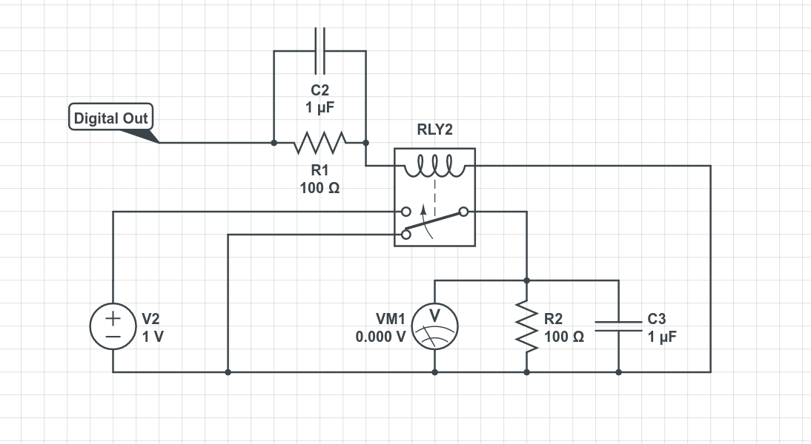

# Step Down Converter
A step down converter converts one DC voltage to another lower DC voltage. 
This is done by modulating the input voltage and then smoothing it with an inductor and or capacitors.
A step down converter was constructed with the goal of building a circuit in the cheapest possible way. 
Therefore it using a relay as the main switching element and capacitors as the smoothing element. The voltages were monitored and controlled by an Arduino Uno.

# Circuit Description

Above is shown the circuit diagram of the step down converter. There are three main components of the circuit: the Arduino, the switching element and the load.
## Arduino
The arduino is not directly shown but it controls the relay using `Digital Out`, supplies voltage at V2 and monitors voltage of the load at VM1. At regular user definable intervals it checks the voltage of the load. If the voltage is greater then the desired load voltage (VL) then the relay is switched to the normally closed position where the load is set to ground. If the load voltage is below VL then the relay is set to normally open and the load is set to 5V.
## Relay
The relay controls the voltage to the load. In between the relay control pins and the Arduino digital out pins there is a 100 uF capacitor in parallel with a 1k Ohm resistor in order to smooth the control signal. WIthout the capacitor and resistor the arduino would frequently crash at high switching frequencies. This is likely caused by the relay inductance giving feedback back to the Arduino pins which the Arduino could not withstand.
## Load
# Real World Performance